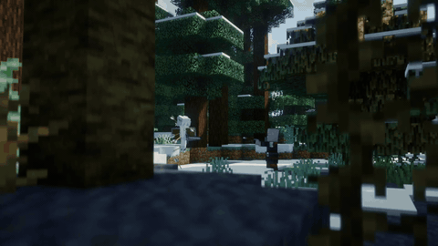
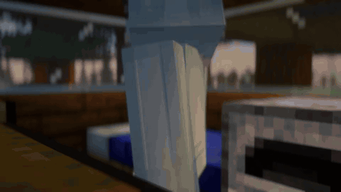

# Fractured

Fractured turns the player into a half-slime with custom growth, movement, damage, and recovery mechanics.

## Features

### Slime Form

- Activate and deactivate SlimeForm with `/slime` and `/slime off`.
- Slime size controls maximum health and can be recovered by eating slimeballs.
- SlimeForm players use slime movement, landing, hurt, and death sounds with slime particles.
- Damage is modified by type: projectile damage is reduced by 50%, fall damage by 80%, explosion damage by 25%, and fire/lava damage is increased by 25%.

### Split and Reform

When a SlimeForm player dies, they split into smaller slime fragments. If the fragments survive and defeat the responsible target, the player reforms at the surviving slime's location. Otherwise, the player respawns at their spawn point and loses their inventory.

[Open the full-resolution WebM preview](docs/video/respawn.webm)

### Sleeping Transformation

Sleeping players are represented by a slime while SlimeForm is active.

[Open the full-resolution WebM preview](docs/video/sleeping.webm)

### Dormant and Passive Slime Behavior

Inactive SlimeForm players can enter a protected dormant state. SlimeForm can also attract nearby passive slimes when enabled.

## Configuration

The Mod Menu configuration screen supports:

- Maximum slime size.
- Slimeballs required for size recovery.
- Split recovery duration.
- Passive slime spawning and spawn limits.
- AFK dormant behavior and inactivity duration.
- Advanced rider positioning offsets.
- Slime water behavior.

## License

Fractured is released under the CC0 1.0 Universal license. See [LICENSE](LICENSE) for the full text.
