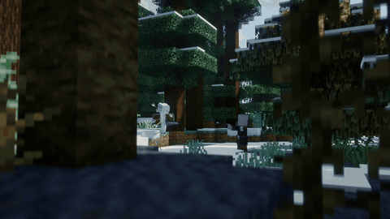
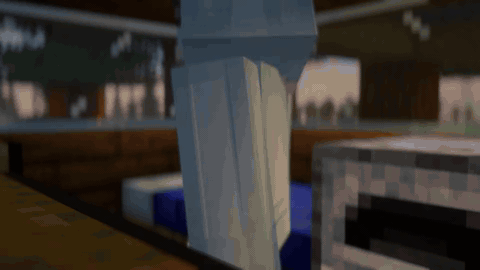

# Fractured

rewriting this soon sooo just read the placeholder desc for now.. sorry :/
## Features

### Slime Form

- Activate and deactivate SlimeForm with `/slime` and `/slime off`; automatic activation on join and respawn is available in the configuration.
- Slime size controls maximum health and can be recovered by eating slimeballs.
- SlimeForm players use slime movement, landing, hurt, and death sounds with slime particles.
- Damage is modified by type: projectile damage is reduced by 50%, fall damage by 80%, explosion damage by 25%, and fire/lava damage is increased by 25%.

### Split and Reform

When a SlimeForm player dies, they split into smaller slime fragments. If the fragments survive and defeat the responsible target, the player reforms at the surviving slime's location. Otherwise, the player respawns at their spawn point and loses their inventory.

### Sleeping Transformation

Sleeping players are represented by a slime while SlimeForm is active.

### Dormant and Passive Slime Behavior

Inactive SlimeForm players can enter a protected dormant state. SlimeForm can also attract nearby passive slimes when enabled.

When experimental slime morphing is enabled, active players can press the configurable `H` key (under SlimeForm controls) to become a full slime. Press it again to return; transitions can be reversed by pressing the key during the animation.

Use `/slime morph size <positive integer>` to set a custom size for the next morph, or `/slime morph size reset` to return to the player's normal slime size. Custom morph sizes persist per player and may exceed the configured maximum slime size.

### Experimental SlimeForm Phasing

When SlimeForm is active, `/slime experimental doPhase true` allows players to phase through blocks tagged as waterloggable. Use `/slime experimental doPhase false` to disable it.

### Experimental Slime-Chunk Aura

When enabled, Overworld chunks within 8 chunks of an active, non-dormant SlimeForm player temporarily behave as slime chunks. Toggle it in the Experimental configuration section or with `/slime experimental slimeChunks true|false`.

The temporary slime-chunk chance defaults to 50%. Aura spawning uses the underground slime-chunk path below Y=40 and ignores the biome-gated surface path; moon phase does not affect it.

While the aura is enabled, hold the configurable `G` key to outline loaded entities inside the full aura. Slimes glow green, hostile mobs red, and players or other mobs white.

### Experimental Swamp Spawning

When enabled, active SlimeForm players naturally spawn in the nearest swamp biome when they do not have a valid bed or respawn anchor. Beds and respawn anchors always take priority; if no swamp is found nearby, vanilla spawning is used.

## Configuration

The Mod Menu configuration screen supports:

- Maximum slime size.
- Automatic SlimeForm activation on join and respawn.
- Slimeballs required for size recovery.
- Split recovery duration.
- Passive slime spawning and spawn limits.
- AFK dormant behavior and inactivity duration.
- Advanced rider positioning offsets.
- Slime water behavior.

## License

Fractured is released under the CC0 1.0 Universal license. See [LICENSE](LICENSE) for the full text.
